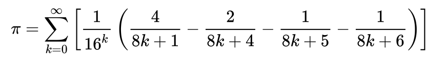

# Solution Report

## Table of Answers
- [Multithreaded Pi Calculation](#Multithreaded-Pi-Calculation)
- [Second Question](#Second-Question)

## Multithreaded Pi Calculation 

### Introduction
In this report, I will outline the implementation details of a multithreaded program for calculating the mathematical constant π (pi) to a specified number of floating-point digits.

### Solutions and Implementations
1. **Multithreading Approach**: The program utilizes the ExecutorService from the java.util.concurrent package to create a thread pool. By employing a fixed thread pool with a size of 5, we can control the number of concurrent threads executing the calculation tasks.

2. **Mathematical Algorithms for Pi Calculation**: Various algorithms exist for calculating π, each with different trade-offs in terms of accuracy and computational efficiency. For this implementation, I experimented with the Bailey–Borwein–Plouffe (BBP) formula, known for its rapid convergence to π.

### BBP Algorithm for Pi Calculation
The BBP algorithm utilizes series summation to calculate π. It involves iterating over terms of the series, computing each term independently, and summing them up to approximate π. The advantage of the BBP formula lies in its rapid convergence, allowing for efficient computation of π to a high degree of accuracy.

The BBP formula used in this implementation involves summing terms of the form  :

### References and Resources
- Wikipedia:
    - [Bailey–Borwein–Plouffe formula](https://en.wikipedia.org/wiki/Bailey%E2%80%93Borwein%E2%80%93Plouffe_formula)
